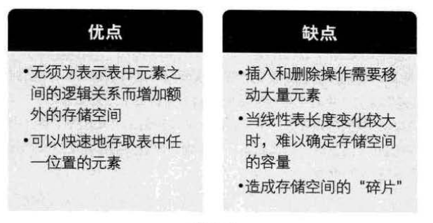

# 数据结构
## 第一章 绪论
### 1.1基本概念

#### 1.1.1 数据
**数据：**是描述客观事物的符号，是计算机中可以操作的对象，是能被计算机识别，并输入给计算机处理的符号集合。不仅包括整形、浮点型等数值类型，还包含字符及声音、图像、视频等非数值类型。
#### 1.1.2 数据元素
**数据元素：**是组成数据的、有一定意义的基本单位，在计算机中通常作为整体处理。也称为记录。比如人类中，人为一个数据元素。
#### 1.1.3 数据项
**数据项：**一个数据元素由若干个数据项组成。数据项是数据不可分割的最小单位。比如人这个数据元素，有手、脚、年龄、性别等数据项。
#### 1.1.4 数据对象
**数据对象：**是性质相同的数据元素的集合，是数据的子集。
#### 1.1.5 数据结构
**数据结构：**是相互之间存在一种或多种特定关系的数据元素的集合。

### 1.2逻辑结构与物理结构
#### 1.2.1 逻辑结构  
**逻辑结构：**是指数据对象中数据元素之间的相互关系。  

1. 集合结构：集合结构中的数据元素除了同属于一个集合外，他们之间没有其他关系。如图：  
  
2. 线性结构：线性结构中的数据元素之间是一对一的关系。如图：  
  
3. 树形结构：树形结构中的数据元素之间存在一种一对多的层次关系，如图：    
  
4. 图形结构：图形结构的数据元素是多对多的关系，如图：  
 
   
#### 1.2.2 物理结构 （即存储结构）
**物理结构：**指数据的逻辑结构在计算机中的存储形式。  数据的存储结构应正确反映数据元素之间的逻辑关系，如何存储数据元素之间的逻辑关系，是实现物理结构的重点与难点。  
数据元素的存储结构形式有两种：顺序存储和链式存储。

1. 顺序存储结构：是把数据元素存放地址连续的存储单元里，其数据间的逻辑关系和物理关系是一致的。如图  
 
2. 链式存储：把数据元素存放在任意的存储单元里， 这组存储单元可以是连续的，也可以是不连续的。通过指针存放数据元素的地址。   
 

### 1.3 抽象数据类型
1.3.1 数据类型  
**数据类型：**指一组性质相同的值的集合及定义在此集合上的一些操作的总称。  
1.3.2 抽象数据类型  
**抽象数据类型（Abstract Data Type：ADT）：**指一个数字模型及定义在该模型上的一组操作。抽象数据类型体现了程序设计中问题分解、抽象和信息隐藏的特性。将问题分解为多个规模小且容易处理的问题，然后建立一个计算机可处理的数据模型，并将每个功能模块的实现细节作为一个独立的单元，从而将具体实现过程隐藏起来。

## 第二章 算法 
### 2.1算法定义
算法是解决特定问题求解步骤的描述，在计算机中表现为指令有限序列，并且每条指令标识一个或多个操作。
### 2.2 算法特性
算法有五个基本特性：输入、输出、又穷性、确定性和可行性。

1. 输入输出 ：具有零个或多个输入，具有至少一个或多个输出。
2. 有穷性：指算法在执行有限的步骤之后，自动结束而不会出现无限循环，并且每一个步骤在可接受的时间内完成。
3. 确定性：算法的每一步都具有确定的含义，不会出现二义性。
4. 可行性：算法的每一步都必须是可行的，即每一步都能够通过执行有限次数完成。

### 2.3 算法设计要求
1. 正确性：算法的正确性指算法至少应该具有输入、输出和加工处理无歧义性、能正确反映问题的需求、能够得到问题的正确答案。
2. 可读性：算法设计的另一目的是为了便于阅读、理解和交流。
3. 健壮性：当输入数据不合法时，算法也能做出相关处理，而不是产生异常或莫名其妙的结果。
4. 时间效率高和存储量

### 2.4 算法时间复杂度
#### 2.4.1算法时间复杂度定义  
>在进行算法分析时，语句总的执行次数T(n) 是关于问题规模n的函数，进而分析T(n)随n的变化情况并确定T(n)的数量级。算法的时间复杂度，也就是算法的时间量度，记作：T(n)=O(f(n))。它标识随问题规模n的增大，算法执行时间的增长率和f(n)的增长率相同，称作算法的渐近时间复杂度，简称为时间复杂度。其中f(n)是问题规模n的某个函数。

用大写O()来提现算法时间复杂度的记法，称之为大O记法。一般情况下，随着n的增大，T(n)增长最慢的算法为最优算法。
#### 2.4.2 推导大O阶方法
>推导大O阶：  
>1.用常数1取代运行时间中的所有加法常数。  
>2.在修改后的运行次数函数中，只保留最高阶项。  
>3.如果最高阶项存在且不是1，则去除与这个项相乘的常数。  
>得到的即为大O阶

	栗子🌰
	void function (int count)
	{
		int j;
		for (j=count;j<n;j++){
			// 时间复杂度为O(1)的程序步骤序列
		}
	}
	
	n++;                                         // 执行次数为1
	function(n);								// 执行次数为n
	int i,j;									
	for(i=0;i<n;i++){                           // 执行次数为n²
		function(i);
	}
	for(i=0;i<n;i++){       	                // 执行次数为n(n+1)/2
		for(j=i;j<n;j++){
			// 时间复杂度为O(1)的程序步骤序列
		}
	}

它的执行次数f(n)=1+n+n²+n(n+1)/2=3/2n²+3/2n+1,根据推导大O阶方法：
>1.常数项已经为1，不处理  
>2.保留最高项，即3/2n²  
>3.去除这个项相乘的常数，即获得n²  

得到时间复杂度为O(n²)

#### 2.4.3 常见时间复杂度
执行次数| 阶 | 非正式用语 |
----|----|----|
12| O(1) | 常数阶|
2n+3| O(n) | 线性阶|
3n²+2n+1| O(n²) | 平方阶|
5㏒n+20| O(㏒n) | 对数阶|
2n+3nlogn+19| O(n㏒n) | n㏒n阶|
6n³+2n²+3n+4| O(n³) | 立方阶|
2的n次方| O(2的n次方) | 指数阶|
复杂度消费时间从上往下依次增大

## 第三章 线性表
### 3.1 定义
线性表(list):零个或多个数据元素的有限序列。

### 3.2线性表的顺序存储结构
`线性表的顺序存储结构，指的是用一段地址连续的存储单元一次存储线性表的数据元素`

